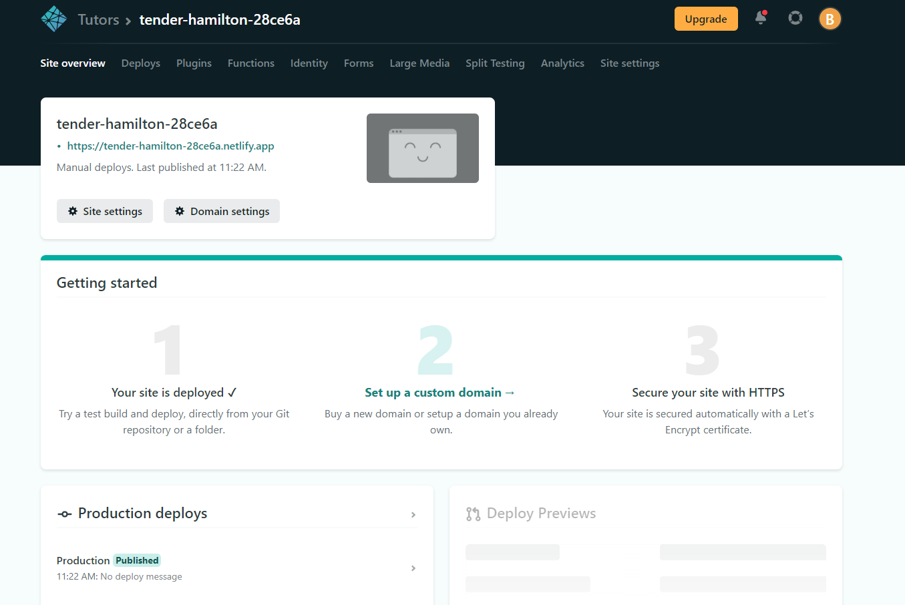
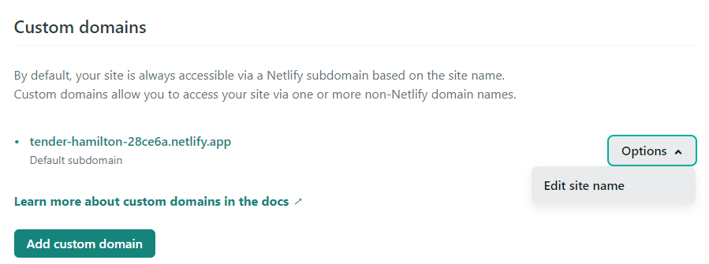
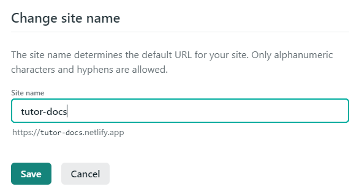

# Configure and Deploy via Netlify

1. Navigate to Netlify via the following link and select `Sign up`, located to the top right of the screen. You can also simply log in via your GitHub or BitBucket accounts:
    - [Netlify](www.netlify.com)

2. Create an account and log in. You should see a page like this:

     

3. Underneath the `Sites` heading is a box where you should drag and drop the `json` folder from inside the `tutors-starter` folder. 

    - Only drag the `json` folder into the box, if you drag anything other than the json folder into this box, the site will not deploy. 

     

4. The site will deploy and you will be redirected  to the site overview page:

     

5. You can see under `Production Deploys` that the site has been published, click the link in the box at the top of the page. 

     

6. This will bring you to your Tutors course website.

     

7. Navigate back to Netlify and select the `Domain settings` button, then scroll down to the `Custom Domains` section.
     

8. Click the Dropdown `Options` button and select `Edit site name`.
     

9. Enter the desired domain name for your Tutors site and click `Save`.
     
     
10. Return to the `Site Overview` page where you will notice the link to your site has changed.

In the next section, we will explore the file structure and components of a Tutors course before making some small changes.

